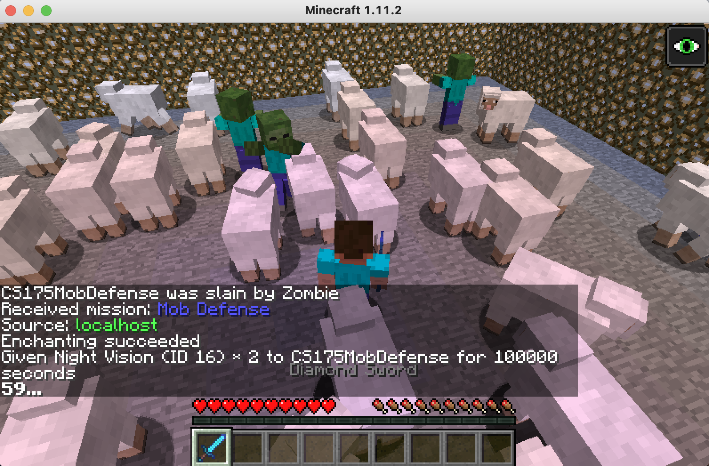
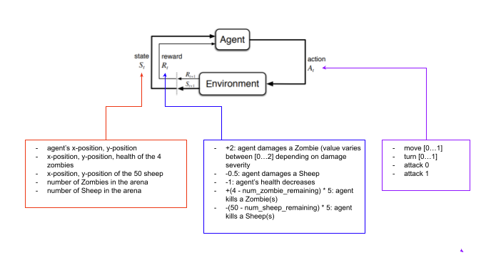
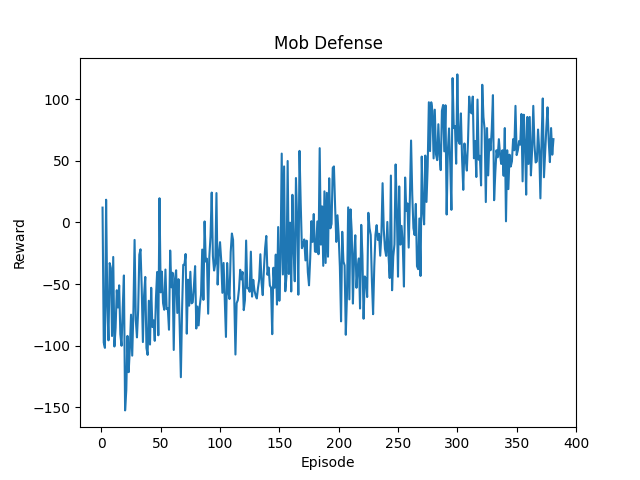

## Video Summary

## Project Summary

The goal of Mob Defense is to train the agent to efficiently and effectively kill Zombies. We've placed the agent in a 20x20 arena with 4 Zombies and 50 sheep. The Zombies and Sheep are randomly placed throughout the arena at the beginning of each episode. The agent is equipped with an enchanted diamond sword and night vision. We initially considered respawning Zombies after the agent kills a Zombie, however we felt that this may convolute our data. We chose to only spawn 4 Zombies per episode to maintain a consistent learning environment, which will ensure that the agent's ability to attack and survive is actually improving. We also placed 50 sheep in the arena as obstacles for the agent. As sheep are friendly mobs in Minecraft, we wanted the agent to learn to avoid attacking and killing the sheep. Each episode spans one minute and concludes if time runs out or the agent gets killed by the Zombies. Its mission is to kill all 4 Zombies before time runs out while incurring minimal damage to health.  

This task requires AI/ML techniques to achieve because in order for the agent to survive it needs to make strategic decisions on whether it should run away from the Zombies (fight or flight), which Zombie to attack first, and the unintended damage it may cause to surrounding sheep. For example, if the agent exists in a state where a Zombie is surrounded by a lot of sheep, it may be more ideal for the agent to move away and wait for the sheep to disperse, instead of attacking the Zombie at that moment and possibly racking up negative reward for unintentionally damaging the surrounding sheep. 

## Approaches
Originally, we had the agent move and turn towards the "Zombiest" point. The "Zombiest" point was calculated using the health of the Zombies and the area with the highest number of Zombies. This method prioritized Zombies with lower health because they are easier for the agent to kill. Then, the agent would consider the area with a high number of Zombies because that is where there is greatest opportunity for positive reward. However, we observed that  if the agent tries to attack and turn away from a Zombie in the "Zombiest" point, it was unable to turn away fast enough from the other Zombies and would continue getting hit and die. We also felt that by using the "Zombiest" point that we were telling the agent too much information on how to behave, so it wasn't able to learn as much. The agent was essentially already behaving optimally because it was being told to directly go towards the area with Zombies.

In this final sprint, we are using reinforcement learning to train our agent to attack Zombies, while keeping itself and the surrounding sheep alive. Our reinforcement learning model is based on a Markov Decision Process because after every step in an episode, the agent must make the best decision based on the current state generated by the its previous action. After each step, the environment's state changes because the agent's health may have decreased, the Zombies' health may have decreased, and the position of the Zombies may have changed. In each state, we've created a continuous action space based off of Assignment 2. At each step, the agent has the ability to `move [0...1]`, `turn [0...1]`, `attack 0`, and `attack 1`. When a Zombie comes into the agent's "line of sight", the agent will attack the Zombie using its enchanted diamond sword. Additionally, we've programmed the agent to stop moving and turning when it sees a Zombie, so that it has enough time to attack the Zombie to its fullest ability.  

  

 
 
The reward structure is as follows:  
 

| Reward  | Action |
| ------------- | ------------- |
| +10  | Agent damages a Zombie (exact float value can vary between [0...2] on the damage severity )  |
| -1 | Agent damages a Sheep  |
| -5  | Agent's health decreases due to being attacked by a Zombie  |
| +(4 - num_zombie_remaining) * 40  | After each episode, the agent can receive a positive reward based on the number of Zombies it has killed. (Ex: If only 2 Zombies remained: +(4-2)*40 = +80)  |
| -(50 - num_sheep_remaining) * 2  | After each episode, the agent can receive a negative reward based on the number of Sheep it has killed. (Ex: If only 2 Zombies remained: -(50-48)*2 = -4)  |
 
 

Our number one goal for the agent was for it to damage and kill Zombies, so we put high positive rewards on both of those actions. If the agent is able to kill a Zombie, the kill reward is worth 4x more than the reward for damaging a Zombie per Zombie killed. The next goal we wanted to prioritize for the agent was to stay alive, so we put a decent sized negative reward on the agent if its health decreased after a step. Our lowest priority goal for the agent was to not attack the Sheep. Since Sheep are friendly mobs in Minecraft, the agent naturally does not attack it. However, sometimes the Sheep ended up in harm's way when the agent attempts to attack a Zombie. We wanted the agent to consider the surrounding Sheep and to hold off on killing the Zombies if it would result in accidentally killing a Sheep. 

## Evaluation
### Quantitative
  
 
We evaluated our agent quantitively by plotting the total reward after each episode. Each episode is 60,000 ms long or concludes when the agent is killed. Looking at our graph, the agent performed poorly during the first 100 episodes. It was primarily accumulating negative reward, meaning it was taking a lot of damage from the Zombies and hitting Sheep. After about 100 episodes we can start to see some sustained improvement and that the agent is now accumulating positive reward. Compared to our previous graph, this one shows an uptrend signaling that more learning is going on. We believe that this uptrend is due to changing the reward structure as well as making more of the movements learned (moving and turning). Once the agent kills a Zombie, there is a substantial reward so it begins prioritizing killing the Zombies instead of running away.

### Qualitative
During the first few hundred of episodes, the Zombies were easily attacking the agent. The agent was moving and turning fairly randomly and was consistently getting hit and losing health. The agent also kept dying before the 60 second episode time limit was up. We noticed that the agent tended to gravitate towards the walls after it was hit by a Zombie. Unlike the agent that was learning based on the "Zombiest" point, this agent was prioritizing running away from the Zombies rather than facing the Zombies head on.  After running the program for 5 hours (400 episodes), we saw an improvement in the agent's behavior, such that the agent was able to move away from Zombies and attack the Zombies if it was close enough. The agent was able to kill all 4 Zombies in the arena while maintaining a good amount of health and minimizing damage to the Sheep.

## References
- [Malmo XML Schema Documentation](https://microsoft.github.io/malmo/0.21.0/Schemas/MissionHandlers.html)
- [Minecraft Enchantment Command](https://www.digminecraft.com/game_commands/enchant_command.php)
- `hit_test.py` from Malmo's Python Examples
- UC Irvine CS 175's Assignment 2
- [GeeksforGeeks MDP Explanation](https://www.geeksforgeeks.org/markov-decision-process/)
- [MDP Diagram](https://www.google.com/url?sa=i&url=https%3A%2F%2Ftowardsdatascience.com%2Fintroduction-to-reinforcement-learning-markov-decision-process-44c533ebf8da&psig=AOvVaw0fLUNNQBsAcZyybBKKqMg1&ust=1639008147546000&source=images&cd=vfe&ved=0CAwQjhxqFwoTCKCJp6vz0vQCFQAAAAAdAAAAABAD)
