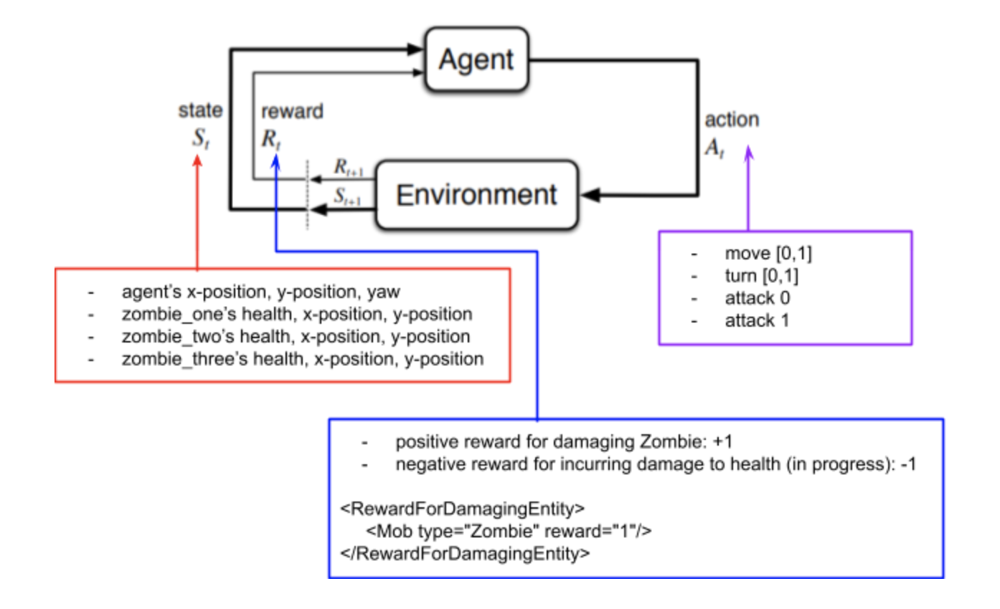

## Project Summary
Our goal for the project has somewhat changed from our initial proposal. Our original idea was to train the agent to differentiate between hostile mobs (e.g., zombies) and friendly mobs (e.g., pigs) by positively rewarding it for killing hostile mobs and negatively rewarding it for killing friendly mobs. This turned out to be more challenging than expected, so for now we've decided to focus on training the agent to damage and kill a fixed number of zombies in a closed arena. The optimal goal for the agent is to kill all of the zombies in the arena without incurring damage to health or dying. 

## Approach
We are using reinforcement learning to train our agent. Since there are three zombies in the arena with the agent, we've applied concepts of Markov decision processes (MDP) to determine which zombie the agent should prioritize in attacking. The state of the world changes every time a zombie moves to a different position. In each state, our agent first considers moving towards zombies with lower health because those zombies will be easier to defeat. Then, it considers the area in the arena with the most zombies because that is where there is most opportunity for reward. Mathematically, this is computed by taking the agent's current x-position, y-position, and yaw and multiplying weights in favor of the direction that are the "zombiest". 

The agent exists in a continuous observation space and its available actions are turning, moving, and attacking. Using the "line of sight" observation, the agent attacks with its sword when there is a zombie in its "line of sight". Currently, the agent is only able to receive a +1 reward when it damages a zombie. We are actively trying to add a negative reward for when the agent incurs damage from the zombies. 

## Evaluation
### Qualitative

### Quantitative

## Remaining Goals and Challenges

Firstly, we need to figure out how to add a negative reward for when the agent incurs damage. Secondly, we plan to add a friendly mob that the agent SHOULD NOT attack. Lastly, we need to respawn zombies after they are killed, so that the agent's reward is not upper bounded by the number of zombies in the arena. 

## Resources Used
- [Malmo XML Schema Documentation](https://microsoft.github.io/malmo/0.21.0/Schemas/MissionHandlers.html)
- [Minecraft Enchantment Command](https://www.digminecraft.com/game_commands/enchant_command.php)
- `hit_test.py` from Malmo's Python Examples